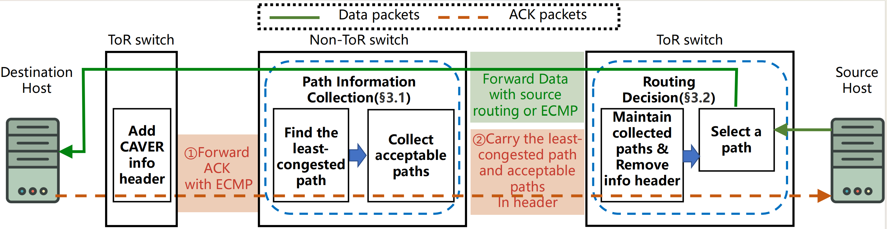

# CAVER: Enhancing RDMA Load Balancing by Hunting Less-Congested Paths



This project contains the simulation and programmable-switch prototypes for our ACM SIGCOMM 2024 Posters and Demos paper, **CAVER: Enhancing RDMA Load Balancing by Hunting Less-Congested Paths**.

CAVER is a congestion-aware load-balancing scheme for RDMA networks. It uses ACK packets to propagate path-congestion information through a vector-based protocol, allowing source ToR switches to discover less-congested paths in real time. Each flow is forwarded along a selected source-routed path to avoid packet reordering and routing oscillation.

- **Paper:** [CAVER: Enhancing RDMA Load Balancing by Hunting Less-Congested Paths](https://doi.org/10.1145/3672202.3673729)
- **NS-3 simulator:** [CAVER-LB/CAVER-ns3](https://github.com/CAVER-LB/CAVER-ns3)
- **P4 prototype:** [CAVER-LB/CAVER-P4](https://github.com/CAVER-LB/CAVER-P4)

## Key Features

- **Congestion-aware path selection:** Maintains real-time congestion information for multiple paths between each source–destination pair.
- **Vector-based path discovery:** Piggybacks congestion information on existing RDMA ACK packets without requiring dedicated probe traffic.
- **Fast convergence:** Propagates less-congested path information within approximately one network RTT.
- **Flow-consistent forwarding:** Uses source routing to keep packets from the same flow on a consistent path and avoid packet reordering.
- **Programmable data plane:** Includes a P4 prototype for Barefoot Tofino switches.
- **Reproducible evaluation:** Provides an NS-3 simulator, traffic workloads, experiment runners, and analysis utilities.


## Repository Structure

This project is divided into two repositories:

- [`CAVER-ns3`](https://github.com/CAVER-LB/CAVER-ns3): NS-3 implementation, experiment configurations, traffic generators, runners, and analysis utilities.
- [`CAVER-P4`](https://github.com/CAVER-LB/CAVER-P4): P4 data-plane programs and control-plane code for the hardware prototype.

Important components of the simulator include:

- `src/point-to-point/model/`: CAVER and other RDMA load-balancing implementations.
- `scratch/network-load-balance.cc`: Main simulation program.
- `config/`: Network topologies and experiment configurations.
- `traffic_gen/`: Traffic-trace generation utilities.
- `caver_run.py`: Experiment automation.
- `analysis/deep_analyse.py`: Result analysis and plotting utilities.
- `mix/output/`: Generated simulation results.

## Quick Start

The simulator was tested on Ubuntu 20.04 and is based on NS-3.19.

Install the required dependencies:

```bash
sudo apt install build-essential python3 libgtk-3-0 bzip2 python2 wget git
python3 -m pip install numpy matplotlib pandas cycler
```

Download NS-3.19 and replace its simulator directory with CAVER:

```bash
wget https://www.nsnam.org/releases/ns-allinone-3.19.tar.bz2
tar -xvf ns-allinone-3.19.tar.bz2
cd ns-allinone-3.19
rm -rf ns-3.19
git clone https://github.com/CAVER-LB/CAVER-ns3.git ns-3.19
cd ns-3.19
```

Configure and build the simulator:

```bash
./waf configure --build-profile=optimized
./waf
```

Run an example experiment:

```bash
./autorun.sh fat_k8_100G_OS2 60
```

The first argument specifies the topology, and the second specifies the offered network load.

Each experiment is assigned a unique ID. Experiment metadata is recorded in:

```text
mix/autorun_history.txt
```

Raw results are written to:

```text
mix/output/
```

## Evaluation

CAVER includes implementations and configurations for comparing multiple RDMA load-balancing schemes, including:

- ECMP
- CONGA
- HULA
- ConWeave
- CAVER

After running an experiment, use the utilities in `analysis/deep_analyse.py` to calculate metrics such as:

- Average flow-completion-time slowdown
- 99th-percentile flow-completion-time slowdown
- Small-flow slowdown
- Large-flow slowdown
- Link utilization
- PFC and CNP statistics

For example:

```python
from analysis.deep_analyse import get_basic_result

print(get_basic_result("3-7"))
```

Because traffic generation and simulation contain randomized components, reproduced results may differ slightly between runs.

## P4 Prototype

The [`CAVER-P4`](https://github.com/CAVER-LB/CAVER-P4) repository contains the programmable-switch prototype.

The prototype was developed and tested with:

- Barefoot Tofino 1 switches
- Barefoot SDE 9.4.0
- 100 Gbps links
- Mellanox ConnectX-6 RNICs

Repository components:

- `Caver_ToR/`: P4 and control-plane programs for lower-layer ToR switches.
- `Caver_Middle/`: P4 and control-plane programs for upper-layer switches.
- `switch_config.h`: Switch-port and topology configuration.
- `topo.pdf`: Hardware topology and NIC addressing information.
- `p4_build.sh`: P4 build helper.

If a different physical topology is used, update `switch_config.h` before compiling the programs.

Build the P4 and controller code with the appropriate Barefoot SDE environment:

```bash
make
```

Run the controller and switch program:

```bash
./test
```

The Barefoot SDE, switch firmware, and hardware-specific dependencies are not included in this repository.

## Citation

If you use CAVER in your research, please cite:

```bibtex
@inproceedings{deng2024caver,
  author    = {Haotian Deng and Yuan Yang and Menghao Zhang and Mingwei Xu},
  title     = {{POSTER}: {CAVER}: Enhancing {RDMA} Load Balancing by Hunting Less-Congested Paths},
  booktitle = {Proceedings of the ACM SIGCOMM 2024 Conference: Posters and Demos},
  pages     = {39--41},
  year      = {2024},
  doi       = {10.1145/3672202.3673729}
}
```

## License

The CAVER simulator and P4 prototype are released under the [MIT License](https://opensource.org/license/mit).
